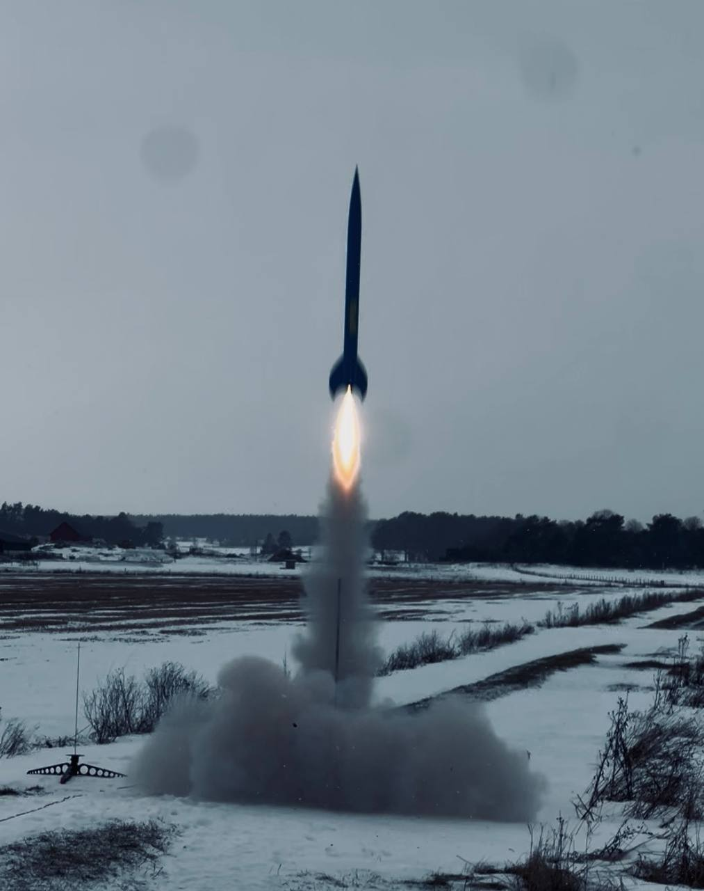
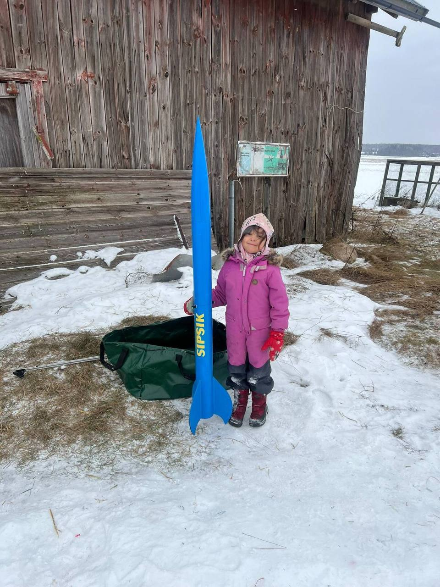

# L1 Certification: Mission Accomplished

*24 January 2026, Enköping, Sweden*

## Sipsik Goes to the Sky

In the Estonian cartoon, a girl named Anu and her brother Mart build a cardboard rocket hoping to send their beloved toy Sipsik to the moon. Now my daughters Liza (5) and Elsa (2) are learning how we *actually* send rockets to the sky.

The blue rocket named **SIPSIK** flew today.

## The Road to Sweden

Why Sweden for an Estonian's L1 certification? Practical reasons:

1. **Motor logistics** - Rocket motors cannot be transported on Tallink passenger ferries (blanket ban on dangerous substances). Must purchase locally.
2. **Family** - Daughter lives in Stockholm
3. **Active club** - SMRK (Swedish Model Rocket Club) runs regular launch events

Took the car on the Tallinn-Stockholm ferry, then drove to Enköping.

The launch was on 24 January as originally planned.

## Launch Day

Temperature around -5°C. Snow on the ground. Classic Swedish winter.

### The Pivot

I arrived with a CATS Vega flight computer and a friend's data logger, planning dual deployment with electronic ejection. Then reality set in:

1. **Cold weather** - Around -5°C
2. **Swedish safety rules** - Ejection charges must be ground-tested before flight
3. **Certification flight** - Keep it simple, reduce variables

Decision: pivot to motor ejection with single parachute recovery.

### Delay Adjustment Math

The H128W-14A comes with 14 second factory delay. For my predicted 208m apogee, I calculated needing about 6 seconds.

**Plan**: Drill out 8 seconds → 14 - 8 = 6s delay

**Reality**: Unknowingly had the +2s disk in the delay adjustment tool during drilling.

**Actual delay**: ~8 seconds (14 - 8 + 2 = 8)

Lesson learned: know your tools before launch day.

### Flight

First attempt. The certificate comment reads "Beautiful low flight" - acknowledging both the successful flight and the lower-than-expected altitude.

**CATS Vega recorded: 141.58 meters**

Lower than the predicted 208m. The likely cause: unplanned extra weight. Two flight computers, extra LiPo batteries, and various small items added up. Weight matters - roughly 30% altitude reduction.

The ~8 second delay (instead of planned 6) meant deployment happened past apogee during descent. Still successful - the rocket was descending slowly enough.

### Recovery

Landed nearby, easy to find. No damage to rocket.

### The Payload

We had a small Sipsik doll on board. I explained to Liza that her real doll is too valuable to risk - what if the rocket falls down? - so this is the "Sipsik of Sipsik", representing her real one.

She was delighted.

## The Certification

Rolf Örell signed my certificate. When he looked at my TRA number - 38105 - he noted it's grown tenfold since his own number: 3728.

Rolf is significant in Tripoli history:

- First Tripoli Prefect in Europe
- [Tripoli Lifetime Member](https://tripoli.clubexpress.com/content.aspx?page_id=22&club_id=795696&module_id=494497)

Special thanks also to **Peter Steen** and **Anton Vannesjö** for their help and guidance throughout the day.

## Lessons Learned

1. **Know your tools** - The Aerotech delay adjustment tool has components (like the +2s disk) that affect the result. Understand everything before launch day.

2. **Swedish launch requirements** - Ejection charges require ground testing. Plan for motor ejection as fallback, or arrive prepared to test.

3. **Weight budget discipline** - Every "small" addition compounds. Two flight computers instead of one, extra batteries, extra hardware. The ~500g over budget cost 30% altitude.

4. **Motor procurement** - Tallink passenger ferries have blanket ban on dangerous substances. No procedure exists, no exceptions. For future Swedish launches: buy motors locally or find cargo transport alternatives.

5. **Simplify for certification** - The goal is successful flight, not maximum complexity. Pivoting to motor ejection was the right call.

## What's Next

Five days after the L1 flight, I passed the Tripoli L2 written exam:

| Field | Value |
|-------|-------|
| Date | 27 January 2026 |
| Certificate # | 2343 |

Next milestone: L2 certification flight with a J, K, or L motor. Target date: 7 February 2026.

Motor ordered (AeroTech J420R-14A), casings purchased (38/720, 29/180). Now waiting for shipping confirmation.

The journey continues.

---

## Flight Data Summary

| Parameter | Value |
|-----------|-------|
| Date | 24 January 2026 |
| Location | Enköping, Sweden |
| Event | SMRK Launch Day |
| Motor | AeroTech H128W-14A |
| Rocket | Apogee Peregrine "SIPSIK" |
| Length | 175 cm |
| Diameter | 100 mm |
| Liftoff weight | 2350 g |
| Predicted altitude | 208 m |
| Actual altitude | 141.58 m |
| Recovery | Motor ejection, single chute |
| Certifying authority | Rolf Örell (TRA# 3728) |
| Result | **L1 CERTIFIED** |

## Tools for Home Testing

For ground testing at home, I 3D printed mass-equivalent motor dummies:

| Motor | Real Weight | Dummy Material |
|-------|-------------|----------------|
| H128W | 208 g | PLA 100% infill + steel rod |
| J420R | 635 g | PLA 100% infill + steel rod |

PLA prints come out 20-25% light. An 8mm hole allows inserting steel rod (~0.4 g/mm) for weight adjustment:

- H128W: ~100-130mm of 8mm rod needed
- J420R: ~300-400mm of 8mm rod needed

Useful for verifying CG position, testing fit, and practicing handling without pyrotechnics.
