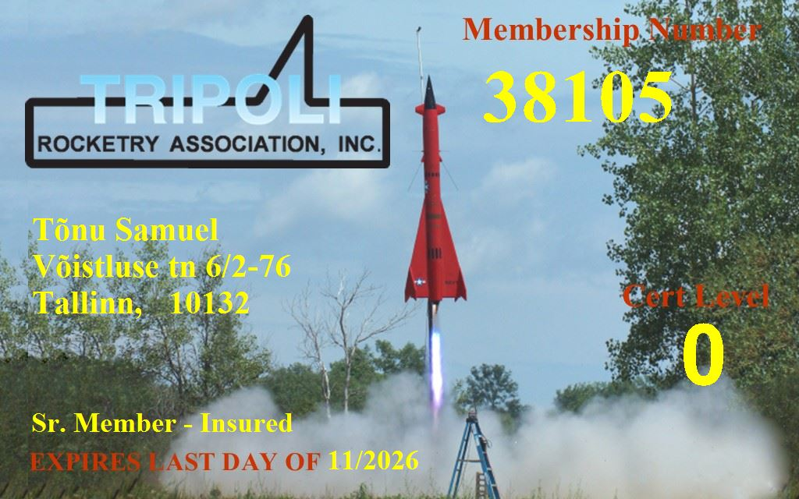

# L1 Certification

## Tripoli Membership

| Field | Value |
|-------|-------|
| Organization | Tripoli Rocketry Association |
| Member Number | 38105 |
| Status | Sr. Member - Insured |
| Current Cert Level | 0 |
| Expires | November 2026 |

## L1 Requirements

Per Tripoli certification standards:

- Successfully fly and recover a rocket using an H or I motor
- Witnessed by a Tripoli Prefect or TAP member
- Rocket must be built by the flyer (kits allowed)
- Safe flight with successful recovery

## Certification Attempt

*Pending - See [Flight Log](../flight/log.md)*

### Planned Details

- **Location**: Sweden (see [Why Sweden](../decisions/why-sweden.md))
- **Rocket**: Apogee Peregrine
- **Motor**: H180W or H210 Redline (see [Motor Selection](../simulations/motors.md))

## Post-Certification

After L1, eligible for:

- L2 certification (J, K, L motors)
- Eventually L3 (M+ motors)
