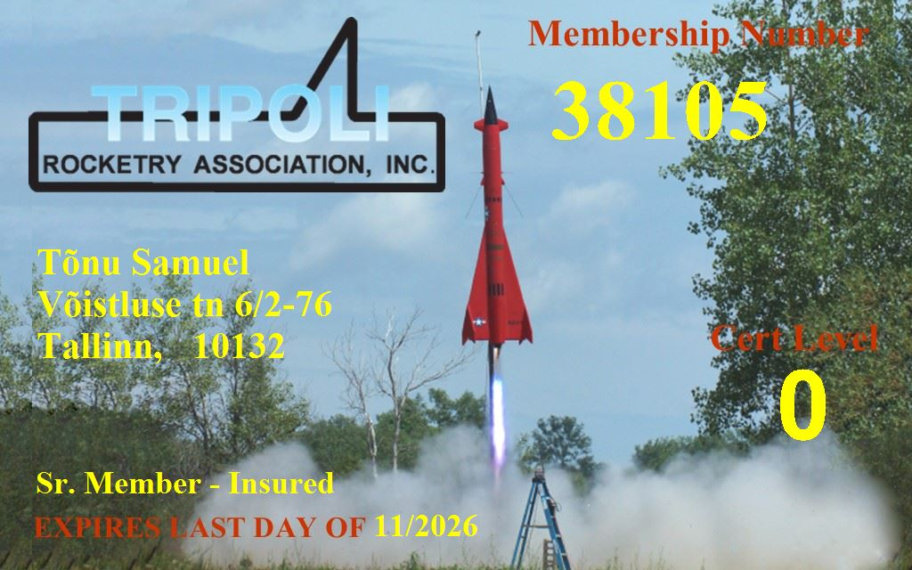
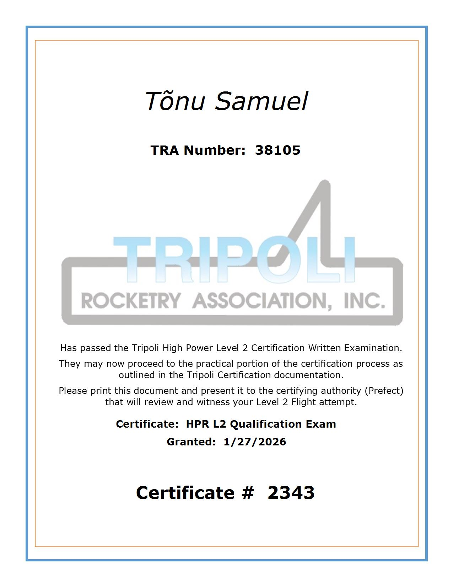

# Certification

## Status: L2 CERTIFIED ✓

**Tripoli Level 2 - Certified 22 February 2026**
**Tripoli Level 1 - Certified 24 January 2026**

## Tripoli Membership

| Field | Value |
|-------|-------|
| Organization | Tripoli Rocketry Association |
| Member Number | 38105 |
| Status | L2 Certified |
| Expires | November 2026 |

---

## L2 Certification Flight

### Flight Video

<video controls width="100%">
  <source src="../photos/l2_certification_flight.mp4" type="video/mp4">
</video>

### Flight Details

| Parameter | Value |
|-----------|-------|
| Date | 22 February 2026 |
| Location | Enköping, Sweden |
| Organization | SMRK (Swedish Model Rocket Club) |
| Motor | AeroTech J350 |
| Result | **Successful** |

### Rocket Configuration

| Parameter | Value |
|-----------|-------|
| Kit | Apogee Peregrine |
| Length | 175 cm |
| Diameter | 100 mm |
| Liftoff weight | 3100 g |
| CG | 115 cm from nose tip |
| CP | 130 cm from nose tip |
| Expected altitude | 1100 m |
| Actual altitude | **986.43 m** (CATS Vega) |
| Max velocity | 172.56 m/s (≈ Mach 0.50) |
| Max acceleration | 17.5 g |

See [Flight #2 Analysis](../flight/flight2-analysis.md) for full telemetry analysis.

### Recovery Configuration

Dual deployment was required by the 500m landing radius constraint. Simulations showed that with main-only recovery from ~1000m, any wind above 4 m/s would carry the rocket beyond the allowed radius.

Triple-redundant ejection system:

- **Electronic #1 (CATS Vega)**: 18" drogue parachute at apogee
- **Electronic #2 (CATS Vega)**: 48" main parachute at lower altitude
- **Motor backup**: Original 14s factory delay left unmodified as independent safety charge

### Electronics

| Device | Purpose |
|--------|---------|
| CATS Vega | Flight computer, dual deployment control (2 pyro channels) |

### L2 Written Examination

| Field | Value |
|-------|-------|
| Passed | 27 January 2026 |
| Certificate # | 2343 |

### Certifying Authority

| Field | Value |
|-------|-------|
| Name | Rolf Örell |
| TRA # | 3728 |
| Role | Tripoli Prefect |

### Official Documents

[Download L2 Certification Form (PDF)](../photos/l2_certification_form.pdf)

---

## L1 Certification Flight

### Flight Details

| Parameter | Value |
|-----------|-------|
| Date | 24 January 2026 |
| Location | Enköping, Sweden |
| Organization | SMRK (Swedish Model Rocket Club) |
| Motor | AeroTech H128W-14A |
| Result | **Successful** |

### Rocket Configuration

| Parameter | Value |
|-----------|-------|
| Kit | Apogee Peregrine |
| Length | 175 cm |
| Diameter | 100 mm |
| Liftoff weight | 2350 g |
| CG | 115 cm from nose tip |
| CP | 130 cm from nose tip |
| Stability margin | 15 cm (~1.5 calibers) |

### Flight Data

| Parameter | Predicted | Actual |
|-----------|-----------|--------|
| Apogee | 208 m | **140.8 m** |
| Recovery | Dual electronic | Motor ejection |

The lower actual altitude was likely due to additional unplanned weight (two flight computers, LiPo batteries, etc.) beyond the original weight budget.

### Electronics

| Device | Purpose | Notes |
|--------|---------|-------|
| CATS Vega | Primary flight computer | Data logging only - not used for deployment |
| Friend's logger | Backup data logging | Additional altitude verification |

### Recovery Configuration

Originally planned dual deployment with electronic ejection. Pivoted to motor ejection on launch day due to:

1. Cold weather conditions
2. Swedish safety rules requiring ejection charge testing before flight
3. Simplified approach for certification flight

**Delay adjustment**: H128W-14A has 14s factory delay. Calculated 6s needed for 208m apogee. Drilled out 8 seconds, but unknowingly had +2s disk in delay adjustment tool. Actual delay ~8 seconds - still successful deployment past apogee.

### Certifying Authority

| Field | Value |
|-------|-------|
| Name | Rolf Örell |
| TRA # | 3728 |
| Role | Tripoli Prefect |

Rolf is one of Tripoli's [Lifetime Members](https://tripoli.clubexpress.com/content.aspx?page_id=22&club_id=795696&module_id=494497) and reportedly the first Tripoli Prefect in Europe.

### Official Documents

[Download L1 Certification Form (PDF)](../photos/l1_certification_form.pdf)

---

## What's Next: L3

L1 and L2 served as verification that the fundamentals were understood correctly. L3 is a different challenge — building a rocket from scratch rather than using a kit.

| Requirement | Status |
|-------------|--------|
| Current L2 certification | ✓ |
| TAP member #1 | Rolf Örell (confirmed) |
| TAP member #2 | TBD |
| Scratch-built rocket | Design phase |
| Documentation package | Not started |
| Review flight | Not scheduled |

---

## Acknowledgments

Special thanks to those who helped make both certifications possible:

- **Rolf Örell** - Certifying authority for L1 and L2
- **Peter Steen** - Launch support and guidance
- **Anton Vannesjö** - Launch support and guidance

## Lessons Learned

### L1
1. **Know your tools** - The Aerotech delay adjustment tool has a +2s disk; understand all components before launch day
2. **Swedish launch requirements** - Ejection charge testing required; plan for motor ejection as fallback
3. **Weight matters** - Additional electronics increased weight beyond budget, reducing altitude by ~30%
4. **Motor procurement** - Cannot transport motors on Tallink passenger ferries (blanket ban on dangerous substances); must purchase locally in Sweden or find alternative transport
