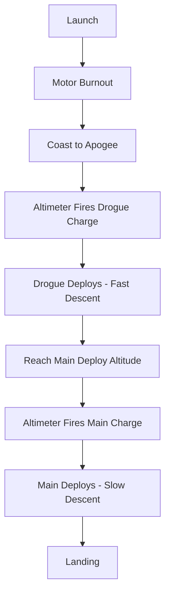

# Recovery System

## Dual Deployment Overview



## Recovery Components

| Component | Size | Location |
|-----------|------|----------|
| Drogue Parachute | 18" (45 cm) | Forward bay (nose to e-bay) |
| Main Parachute | 48" (122 cm) | Aft bay (e-bay to fins) |
| Chute Protectors | 12" Nomex x2 | One per bay |
| Shock Cord (drogue) | Long, orange tubular nylon | Forward |
| Shock Cord (main) | Short, orange tubular nylon | Aft |

## Shock Cord Assignment

!!! important "Cord Lengths"
    Per Apogee instructions:
    
    - **Shorter cord** goes in **forward/drogue** section
    - **Longer cord** goes with **motor mount** (discovered by reading full instructions)

## Chute Protector Attachment

- Attach close to tube exits
- Allow enough slack for chute to fully clear
- Some builders add one protector-width spacing

## Parachute Attachment

Use quick links for easy field changes:

```
Nose Cone Loop ─── Quick Link ─── Shock Cord ─── Quick Link ─── Drogue Chute
                                      │
                                E-Bay Eyebolt
```

## Single Deploy Configuration

For L1 certification (recommended):

1. Place main parachute in aft bay
2. Use motor ejection charge
3. Secure nose cone to upper tube (tape or plastic rivets)
4. Leave drogue removed or use as backup

!!! tip "Shear Pins"
    For dual deploy after certification:
    
    - Use metal screws for single deploy (nose stays attached)
    - Switch to nylon shear pins for dual deploy
    - 2-3 shear pins typically sufficient for Peregrine

## Descent Rate Calculations

See [Ejection Charges](../calculations/ejection-charges.md) for sizing.

Target descent rates:

| Phase | Target Rate |
|-------|-------------|
| Drogue | 50-75 ft/s (fast but controlled) |
| Main | 15-20 ft/s (soft landing) |

## Build Photos

*Photos to be added during construction*
