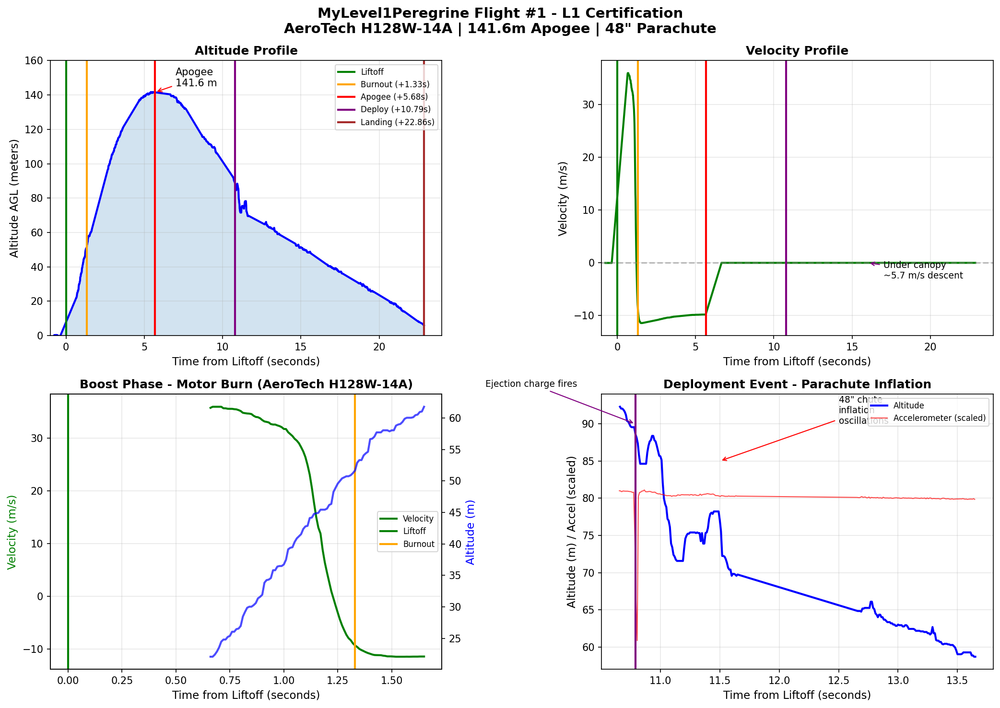

# Flight #1 Analysis

Detailed analysis of CATS Vega telemetry data from the L1 certification flight.

## Problem Statement

Simulation predicted 208m apogee, flight computer logged 141.58m — a 32% shortfall.

## Flight Event Timeline

Data from CATS Vega log file `fl001.cfl`:

| Event | Time (ms) | From Liftoff | Altitude (m) | Velocity (m/s) |
|-------|-----------|--------------|--------------|----------------|
| Liftoff | 278340 | 0.00s | 0 | 0 |
| Burnout | 279670 | 1.33s | 39.84 | 45.69 |
| Apogee | 284020 | 5.68s | 141.58 | 0 |
| Drogue | 284320 | 5.98s | 141.41 | — |
| Main | 284630 | 6.29s | 141.43 | — |
| Deployment (accel) | 289145 | 10.80s | — | — |

**Burn time**: 1.33s (matches H128W specification of ~1.4s)

**Motor delay**: 9.47s (from burnout to deployment shock in accelerometer)

**Deployment after apogee**: 5.12s

## Telemetry Charts

*Altitude, velocity, boost phase, and parachute deployment profiles from CATS Vega data.*

## Accelerometer Deployment Signature

The parachute deployment is clearly visible in the raw accelerometer data as a sudden deceleration shock:

| Time (ms) | From Liftoff | Raw Accel X | Notes |
|-----------|--------------|-------------|-------|
| 289115 | +10.78s | -29698 | Pre-deployment baseline |
| 289125 | +10.79s | -27657 | Shock begins |
| 289135 | +10.79s | -24535 | Deceleration increasing |
| 289145 | +10.80s | -22717 | Peak shock (~7000 LSB change) |
| 289155 | +10.81s | -29504 | Recovery to descent |

The ~7000 LSB change in 30ms represents the sudden deceleration as the parachute opens and catches air. This provides independent confirmation of deployment timing separate from the barometric data.

**Note**: The actual motor delay (9.47s) was longer than intended (8s), possibly due to cold weather (-5°C) slowing the delay grain burn rate.

## Root Cause Analysis

### 1. Mass Discrepancy (Primary Cause)

Physics verification using burnout conditions:

- Burnout velocity: 45.69 m/s at 39.84m altitude
- Theoretical maximum (no drag): $h = \frac{v^2}{2g} + h_0 = \frac{45.69^2}{2 \times 9.81} + 39.84 = 146\text{m}$
- To reach 208m would require burnout velocity of ~58-60 m/s

**Conclusion**: Rocket was significantly heavier than simulation assumed. Additional mass from:

- Two flight computers instead of one
- Additional LiPo batteries
- Other small items not accounted for

### 2. Temperature Compensation Gap

The CATS Vega MS5607 barometric sensor has two temperature-related behaviors:

| Component | Status | Notes |
|-----------|--------|-------|
| MS5607 sensor temperature compensation | ✅ Working | Internal calibration |
| Ambient air temperature in altitude formula | ❌ Hardcoded 15°C | `TEMPERATURE_0` constant |

**Flight conditions**: -5°C

The barometric altitude formula uses temperature to calculate air density. Using 15°C instead of -5°C causes approximately **+7.5% altitude overestimate** (~10m at this altitude).

**Temperature-corrected apogee**: ~132m true altitude

### 3. Venting Lag

The rocket body has no venting holes, causing pressure equalization lag during rapid altitude changes.

**Evidence from telemetry**:

- Altitude plateau at apogee: 141.4-141.6m sustained for ~1 second
- Pressure oscillated between 100680-100730 Pa for 1.5s around apogee
- Ascent velocities appear artificially low
- Only 4.6m apparent drag loss vs expected 15-25m for this rocket/velocity

The internal pressure cannot equalize fast enough, causing the barometer to "see" incorrect ambient pressure.

## Timing Analysis

| Parameter | Simulated | Actual | Difference |
|-----------|-----------|--------|------------|
| Time to apogee | 6.0s | 5.68s | -0.32s (5% faster) |
| Motor delay | 8.0s | 9.47s | +1.47s (18% slower) |

The simulation was accurate on flight timing — the altitude shortfall is primarily from mass discrepancy, not aerodynamics. The longer motor delay is likely due to cold weather affecting the delay grain burn rate.

## Recommendations

### Hardware

1. **Add venting holes** to rocket body for accurate barometric readings
2. **Verify actual flight mass** vs simulation input before future flights
3. **Account for cold weather** when setting motor delays (add margin)

### Firmware

Potential code improvement in CATS firmware — use MS5607 temperature reading in `calculate_height()` instead of hardcoded 15°C constant.

**Relevant code locations** (CATS firmware repository):

| File | Purpose |
|------|---------|
| `flight_computer/src/sensors/ms5607.hpp` | Barometer driver |
| `flight_computer/src/control/data_processing.cpp` | Height calculation |
| `flight_computer/src/config/control_config.hpp` | Config constants (`TEMPERATURE_0`) |
| `flight_computer/src/control/kalman_filter.cpp` | State estimation |

Firmware repository: [tonuonu/cats-embedded](https://github.com/tonuonu/cats-embedded)

## Summary

| Factor | Effect | Correctable |
|--------|--------|-------------|
| Mass discrepancy | Primary cause of altitude shortfall | Pre-flight weighing |
| Temperature compensation | +7.5% overestimate (~10m) | Firmware fix |
| Venting lag | Distorted pressure readings | Add vent holes |
| Cold weather delay | +18% longer burn time | Add safety margin |

Despite the altitude discrepancy, the flight was successful and achieved L1 certification.
