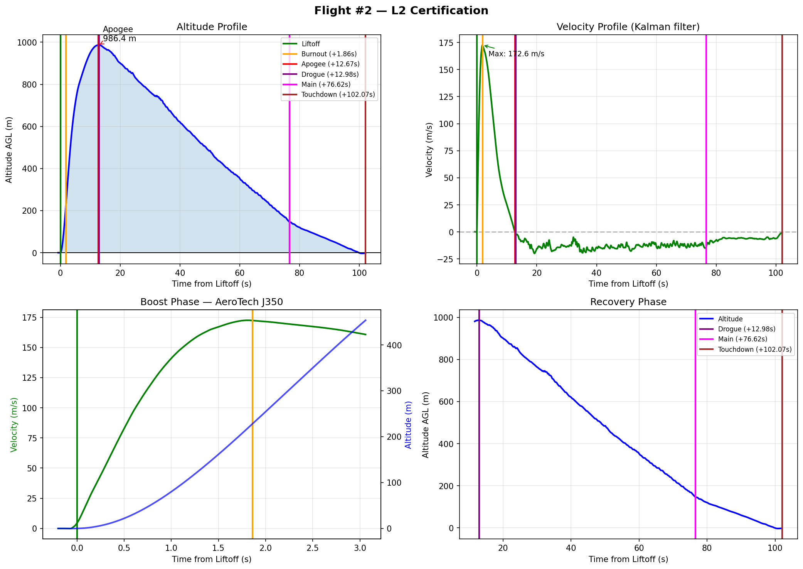

# Flight #2 Analysis

Detailed analysis of CATS Vega telemetry from the L2 certification flight on 22 February 2026.

## Headline Results

| Parameter | Predicted (OpenRocket) | Actual (CATS Vega) |
|-----------|------------------------|--------------------|
| Apogee | 1100 m | **986.43 m** |
| Max velocity | — | **172.56 m/s** (≈ Mach 0.50) |
| Max acceleration | — | **171.63 m/s² (17.5 g)** |
| Burn time | ~2.0 s | **1.86 s** |
| Time to apogee | — | **12.67 s** |
| Total flight time | — | **102.07 s** (liftoff → touchdown) |

Apogee shortfall: **10.4 %** — much smaller than L1's 32 % shortfall.

## Flight Event Timeline (from FLIGHT_STATE records)

The CATS Vega writes a `FLIGHT_STATE` record every time the on-board FSM changes phase. These are the definitive event timestamps.

| Event | FSM transition | T+ (s) | Bootup ts (ms) | Altitude AGL | Velocity |
|-------|----------------|--------|----------------|--------------|----------|
| Liftoff | → THRUSTING | 0.00 | 124510 | 0 m | 0 m/s |
| Burnout | → COASTING | 1.86 | 126370 | ~165 m | 172.56 m/s |
| Apogee / Drogue fired | → DROGUE | 12.98 | 137490 | 986.1 m | -2.9 m/s |
| Main charge fired | → MAIN | 76.62 | 201130 | 146.0 m | -14.3 m/s |
| Touchdown | → TOUCHDOWN | 102.07 | 226580 | -2.1 m | -0.5 m/s |

Liftoff time on launch day: **12:26:44 UTC** (from `st002.txt`).

## Telemetry Charts

*Altitude, velocity, boost-phase detail, and recovery-phase detail.*

## Recovery System Performance

Dual deployment was mandatory for L2 because of the 500 m landing-radius rule (see [Certification](../certification/index.md#l2-certification-flight) for the rationale). The actual recovery profile:

| Phase | Duration | Avg descent rate | Notes |
|-------|----------|------------------|-------|
| Under drogue (18") | 63.6 s | **13.17 m/s** (median 13.19) | Drogue descent from 986 m to 146 m |
| Under main (48") | 25.5 s | **6.34 m/s** (median 6.13) | Main from 146 m to ground |

The main charge fired at **146 m AGL**, matching the configured CATS Vega `main_altitude` setting. Touchdown velocity of 0.5 m/s indicates a clean, well-cushioned landing.

The drogue descent rate of ~13 m/s is in the expected range for a small drogue on a 3.1 kg rocket — the drogue's job is to keep the rocket vertical and prevent zipper, not to slow it significantly.

## Apogee Shortfall Analysis (10.4 %)

The actual 986 m vs predicted 1100 m gap is much smaller than L1's 32 % shortfall. Two factors:

### 1. Better-known launch mass

L1's main shortfall cause was unaccounted mass (two flight computers, batteries, etc.). For L2 the simulation input mass was 3100 g and the flight matched that mass — no surprise weight.

### 2. Old motor reload (likely small impulse loss)

The J350 was a ~25-year-old reload from Rolf Örell's stock (see [flight log](log.md#motor-story)). Nominal J350 specs: 720 Ns total impulse, ~2.0 s burn time. Measured: 1.86 s burn. Estimating the actual total impulse from rocket performance:

For a 3.1 kg rocket reaching 986 m apogee with max velocity 172.56 m/s, the kinetic + potential energy at burnout (≈ 165 m, 172.56 m/s) is:

$$
E_{burnout} = \tfrac{1}{2} m v^2 + m g h = \tfrac{1}{2}(3.1)(172.56)^2 + (3.1)(9.81)(165) \approx 46.1\ \text{kJ} + 5.0\ \text{kJ} \approx 51 \ \text{kJ}
$$

This is consistent with the motor delivering close to its rated impulse minus aerodynamic drag losses during the burn — within a few percent of nominal. The shortfall is not dominated by motor degradation; it is more plausibly a combination of:

- Small drag underestimate in the OpenRocket model
- Slightly lower-than-spec total impulse from the aged reload
- Sub-optimal launch angle (any wind weathercocking)

A drag coefficient sensitivity of just 5 % accounts for 30–50 m of altitude difference at this speed, which more than covers the 114 m gap.

### Temperature compensation gap

The MS5607 barometer-to-altitude conversion in firmware uses a hardcoded 15 °C reference temperature (same issue identified in [Flight #1 analysis](flight1-analysis.md#2-temperature-compensation-gap)). Launch day temperature was around 0 °C, giving roughly +5 % altitude overestimate. Temperature-corrected apogee is approximately **938 m**, making the true shortfall slightly larger (≈ 15 %).

## Comparison with Flight #1 (L1)

| Parameter | L1 (H128W) | L2 (J350) |
|-----------|------------|-----------|
| Motor total impulse | 176 Ns | 720 Ns (≈4×) |
| Liftoff weight | 2350 g | 3100 g |
| Predicted apogee | 208 m | 1100 m |
| Actual apogee | 141.58 m | 986.43 m |
| Shortfall | 32 % | 10.4 % |
| Max velocity | 46.24 m/s | 172.56 m/s |
| Max acceleration | 4.5 g | 17.5 g |
| Burn time | 1.33 s | 1.86 s |
| Time to apogee | 5.68 s | 12.67 s |
| Recovery | Motor ejection | Dual electronic (drogue + main) |
| Total flight time | 26 s | 102 s |

The L2 flight is dramatically more energetic (≈10× kinetic energy at burnout) and the dual-deployment recovery worked as designed.

## Lessons for L3

1. **Trust FLIGHT_STATE records over velocity heuristics** — the on-board FSM transitions give exact, unambiguous event timestamps. Always use them for timeline analysis.
2. **Always download `stXXX.txt` alongside `flXXX.cfl`** — the stats file is the ground-truth cross-check.
3. **CATS configuration `main_altitude` is reliable** — main fired within metres of the configured value.
4. **Drogue descent rate of ~13 m/s is reasonable** for a 3 kg rocket on an 18" drogue; a larger L3 rocket may need more drogue area to keep descent under 20 m/s.

## Source Data

- Binary log: [`data/fl002.cfl`](data/fl002.cfl) (885 KB, 51,455 records parsed at 99.98 % coverage)
- Stats file: [`data/st002.txt`](data/st002.txt) (CATS Configurator export)
- Parsed summary: [`data/fl002.summary.json`](data/fl002.summary.json)
- Format reference: [`data/CATS_FORMAT.md`](data/CATS_FORMAT.md)
- Generator: [`data/generate_charts.py`](data/generate_charts.py)
