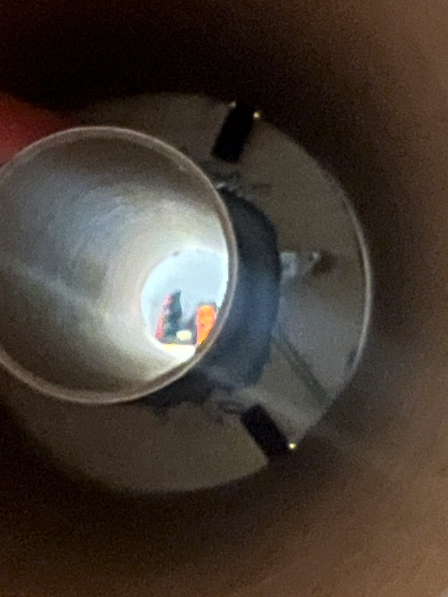
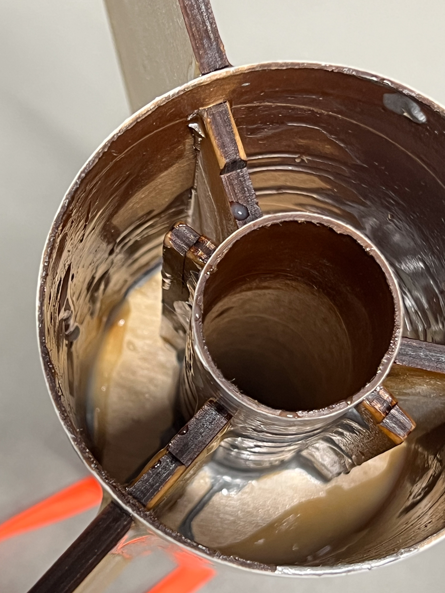
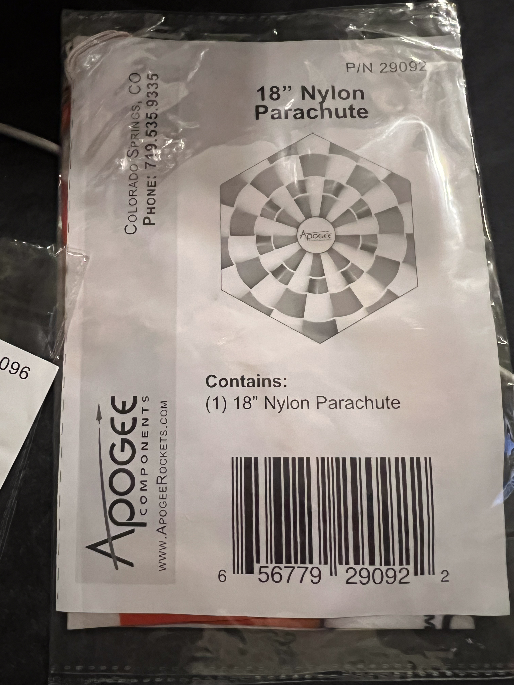

# Photo Gallery

This section contains photographs documenting the build and flight of the Peregrine.

## Organization

Photos are organized by category:

- `kit/` - Unboxing and kit contents
- `build/` - Construction progress
- `finishing/` - Painting and decals
- `flight/` - Launch and recovery photos

## Adding Photos

To add photos:

1. Add image files to appropriate subdirectory in `docs/photos/`
2. Reference in markdown:

```markdown

```

## Kit Packaging

!!! warning "Packaging vs Website Discrepancies"
    See [Kit Contents](../specifications/kit-contents.md#kit-identification) for documented discrepancies between packaging claims and actual specifications.

    - **Skill Level**: Packaging says 4, website says 3
    - **Height**: Packaging says "Over 65"", actual is 68.8"

### IMG_7726 - Front Package Feature List


Features listed on packaging:

- Dual-Deployment recovery for closer-to-the-pad recovery
- High-power rocket kit
- Large and colorful vinyl decals included
- Impressive Size: Over 65" tall and 4" in diameter
- Two colorful nylon cloth parachutes included

Also visible: partial view of body tube with "PEREGRINE" branding.

### IMG_7727 - Motor Requirements and Altitude Table


**Motor Requirements:**

- Requires 38mm diameter rocket motors
- Use H, I or J power rocket motors, as well as high thrust G motors

**Typical altitudes:**

| Motor Class | Altitude Range |
|-------------|----------------|
| G motors | 300-500 feet (requires avg thrust ≥80N) |
| H motors | 600-1700 feet |
| I motors | 1700-3500 feet |
| J motors | 3700-6100 feet |

### IMG_7728 - Required Tools and Materials


**Required Tools and Materials:**

- Hobby Knife / Ruler / Pencil
- Wood Glue (recommended) or White Glue
- Liquid epoxy
- Sand Paper 200 Grit, 400 grit and Sanding Block
- Masking Tape / Scissors / Paper Towel
- Wood Dowel

**Optional Tools / Finishing Supplies:**

- Aluminum "Angle" to draw lines on the tube
- Paint Supplies: Spray Paint, Brushes, etc
- Plastic Sheet (to cover the work surface)
- Safety Glasses (or general protection while building)
- Super Glue (CyA Adhesive medium viscosity)
- Wood Sealer / Sanding Sealer
- RocketPoxy (paste-style)

### IMG_7729 - Kit Identification


- Kit# 04998
- Skill Level 4
- Model rocket kit - assembly required
- Recommended for 18 years and older
- Apogee Components Inc., Colorado Springs, Colorado
- Barcode: 6 56779 04998 8
- Face Card P/N 39101

## Build Progress

### Motor Mount Assembly

#### IMG_6100 - Body Tubes Before Assembly


Main body tube and motor mount tube showing pre-cut fin slots. The 4" outer body tube and 38mm motor mount tube are visible.

#### IMG_6103 - Interior Check



Dark interior view of body tube during initial inspection.

#### IMG_6104 - Nose Cone Interior


Interior view of the nose cone shoulder area.

### Centering Rings and Epoxy Work

#### IMG_6147 - Motor Mount Interior


Interior view showing centering rings installed in the motor mount assembly with epoxy fillets.

#### IMG_6148 - Fin Slots from Inside



View from inside the body tube showing fin slots cut through the tube wall with centering ring visible.

#### IMG_6149 - Epoxy Fillets


Wet epoxy fillets around centering rings for structural reinforcement.

### Fin Installation

#### IMG_6152 - Fins Through Slots


Interior view showing fins inserted through the body tube slots with epoxy work visible.

#### IMG_6153 - Fin Root Fillets


Another interior angle showing fin roots through the slots.

#### IMG_6154 - Looking Down Into Booster


View looking down into the completed booster section showing internal structure.

## Finished Rocket

### Painted Booster Section

#### IMG_6272 - Aft Centering Ring


Aft view of the booster showing:

- Plywood centering ring with "13480" serial number
- 38mm motor tube in center
- Fin slots with fins protruding
- Vent holes drilled in centering ring
- Blue painted body tube edge

#### IMG_6273 - Epoxy Sealed Aft End


Aft centering ring coated with yellow epoxy for sealing and motor retention. Blue painted fins and body tube visible.

#### IMG_6279 - Aft Detail View


Detailed view of aft centering ring showing vent holes, "13480" marking, and fin slot arrangement.

#### IMG_6280 - Complete Booster Aft View


Full aft view of the painted booster section showing:

- Blue painted body tube
- Four blue painted fins
- Centering ring with "13480"
- Rail button/launch lug visible

#### IMG_6434 - Painted Nose Cone


Completed nose cone painted blue to match the booster section.

## Recovery Components

### IMG_6342 - Main Parachute (48")


Main recovery parachute:

- P/N 29096
- 48" Nylon Parachute
- Apogee Components, Colorado Springs, CO

### IMG_6343 - Drogue Parachute (18")



Drogue parachute for dual deployment:

- P/N 29092
- 18" Nylon Parachute
- Apogee Components, Colorado Springs, CO

## Flight Photos

*Photos to be added after certification flight*
